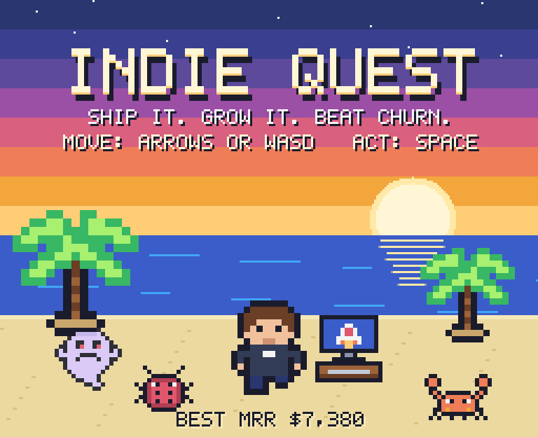
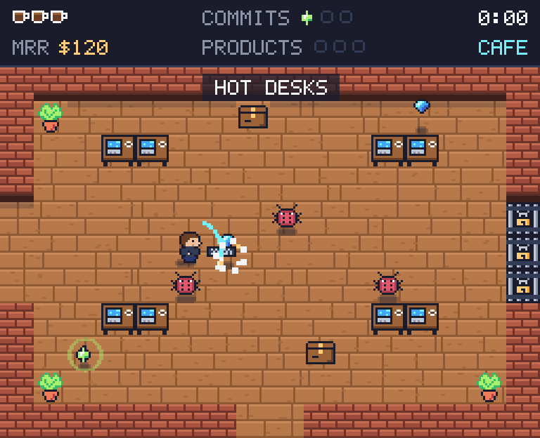
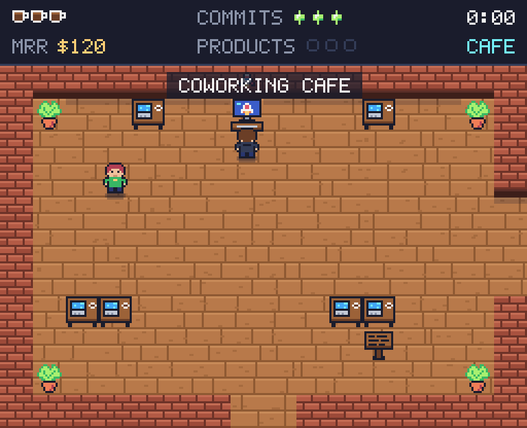
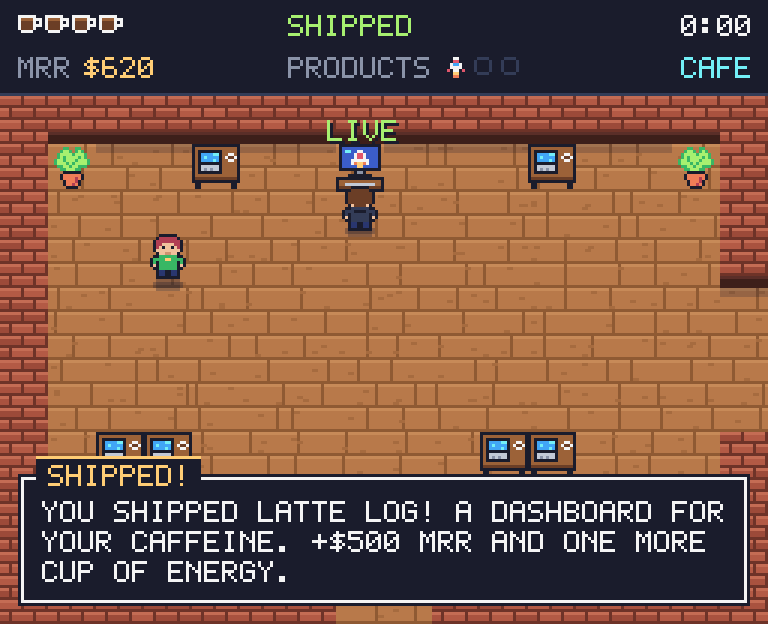
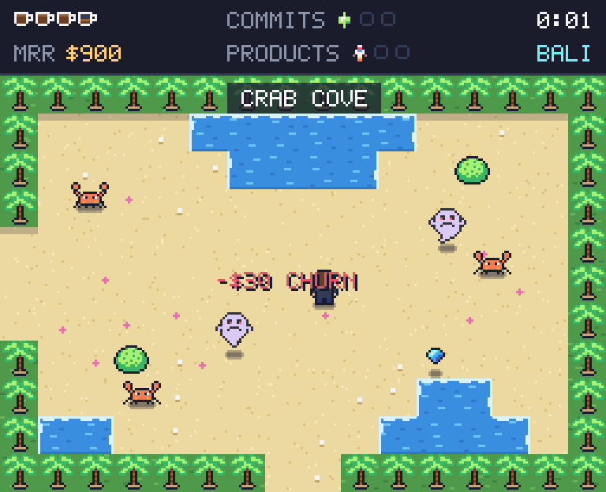
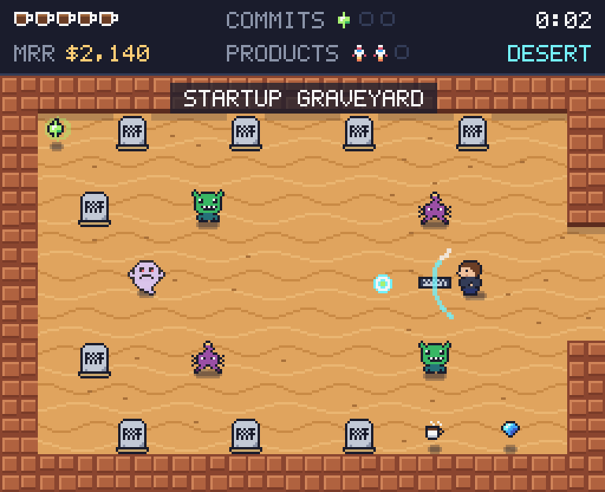
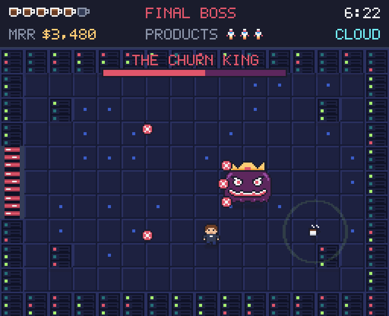
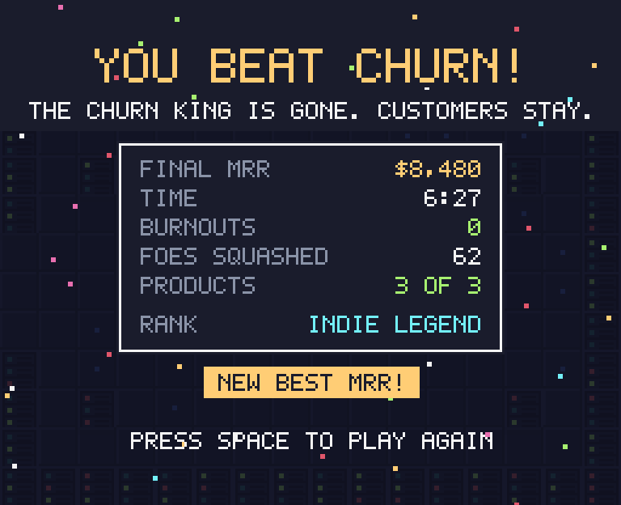
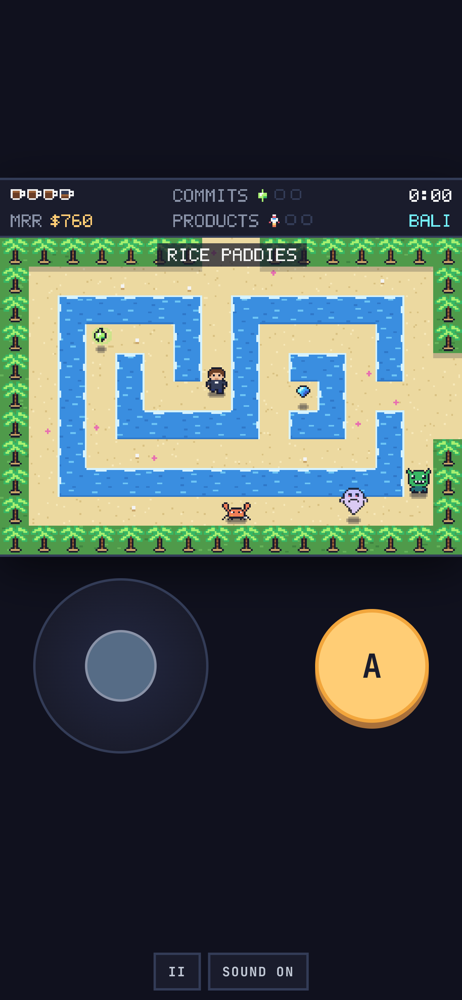

# Indie Quest

Ship it. Grow it. Beat churn.

A top-down pixel adventure for makers. You quit your job. You have a laptop, a keyboard and zero customers. Squash bugs in the coworking cafe, dodge churn ghosts in Bali, outrun scope creeps in the Startup Desert, ship three products and face the Churn King in his cloud.

Plays in the browser. No login, no backend, no downloads. Keyboard, mouse or touch.



## The goal

1. Find 3 commits in each land. Some lie around. Some show up only when a room is clear of foes.
2. Walk to the launch terminal and ship. Each product pays $500 MRR, adds a cup of energy and opens the next land.
3. Ship 3 products, enter the Churn Cloud and beat the Churn King.

Your score is your MRR. Coins and gems add to it. Churn ghosts steal it. Burning out costs 20% of it.

| Product | Land | Unlocks |
|---|---|---|
| Latte Log | Coworking Cafe | Gate to Bali |
| Nomad Nap | Bali | Hotfix: a ranged shot at full energy. Desert road |
| Cactus CRM | Startup Desert | Double damage. The Churn Cloud |

## Controls

| Action | Keyboard | Touch |
|---|---|---|
| Move | Arrows or WASD | Left pad |
| Swing, talk, read, ship | Space, Z, X, J or Enter | A button, or tap the screen |
| Pause | P or Esc | II button |
| Mute | M | Sound button |

A mouse click on the screen also acts. Swing at boxes and bushes to cut them. Swing at a thrown hot take to knock it down.

## Foes

| Foe | What it does |
|---|---|
| Bug | Wanders and bites |
| Churn ghost | Floats through walls and eats $30 MRR on touch |
| Crab | Runs side to side |
| Reply troll | Throws hot takes |
| Scope creep | Charges when you line up with it |
| The Churn King | Three phases. Breaks away and fires a ring after every third hit |

## Screenshots

| | |
|---|---|
|  |  |
|  |  |
|  |  |
|  |  |

## Run it

```bash
npm install
npm run dev        # http://127.0.0.1:5191
npm test           # unit tests and a bot that plays the whole game
npm run build      # static site in dist/
npm run preview    # serve dist/
```

Needs Node 22 or newer.

## How it is built

- Vite, TypeScript and Canvas 2D. No runtime dependencies.
- All art is drawn in code: sprites are text grids in `src/render/sprites.ts`, tiles are painted in `src/render/tiles.ts`, the font is a 5x7 grid in `src/render/font.ts`.
- All sound is WebAudio oscillators and noise in `src/audio/sound.ts`. No audio files.
- Game logic in `src/game/` is pure and runs without a browser, so it is unit tested.
- The screen is 256x208 pixels, scaled up to fit the window.

```
src/
  game/      world map, physics, player, foes, boss, progress, text
  render/    sprites, tiles, font, renderer
  audio/     sound effects and music
  input/     keyboard, mouse and touch
  main.ts    loop, scaling, save of best score
tests/       map, text, sprites, game rules, bot playthrough
```

## Test hooks

Under `npm run dev` the page exposes `window.__iq` (game state, `advance`, `hold`, `enterScreen`) for browser checks. The production build leaves it out. Add `?touch` to the URL to force the touch layout on a desktop.

## Credits

A parody made with love for people who ship. All names, art, music and characters are original. Not tied to any real person, product or company.

## License

MIT. See [LICENSE](LICENSE).
